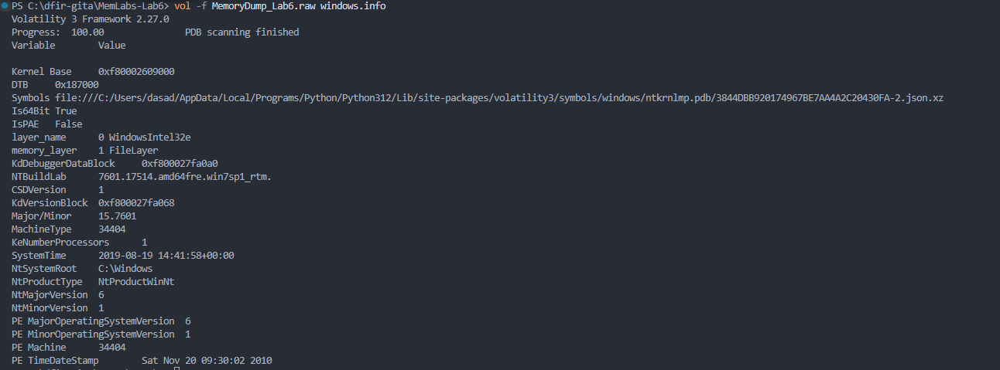
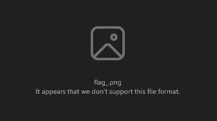
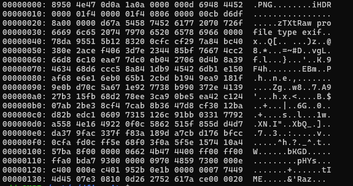

## Introduction to MemLabs

Before we dive into the challenge, let me introduce you to **MemLabs** - an excellent collection of CTF-style memory forensics challenges created by Abhiram Kumar ([@stuxnet999](https://github.com/stuxnet999)). MemLabs is specifically designed for those who want to practice and hone their memory analysis skills in a structured, progressively challenging environment.

The project features six main labs (Lab 1 through Lab 6), each presenting unique scenarios ranging from basic process analysis to complex multi-stage investigations. What makes MemLabs special is its educational approach - the challenges are realistic, well-documented, and perfect for both beginners and intermediate practitioners.

**MemLabs Repository**: [https://github.com/stuxnet999/MemLabs](https://github.com/stuxnet999/MemLabs/tree/master)

Today, we'll be tackling **Lab 6: The Reckoning** - widely considered one of the most comprehensive and challenging scenarios in the collection. This challenge will test our ability to correlate artifacts across multiple sources, think like an investigator, and leverage various Volatility plugins to reconstruct a complete narrative.

---

## Challenge Overview: Lab 6 - The Reckoning

### The Scenario

We've received a memory dump from the Intelligence Bureau Department. According to their briefing, this evidence might contain secrets belonging to **David Benjamin**, an underworld gangster who's been on law enforcement's radar for quite some time. 

The memory dump was captured from one of David's associates - a worker who was apprehended by the FBI earlier this week. Our role as digital forensic investigators is to analyze this memory snapshot and uncover any incriminating evidence that could help build a case against the criminal organization.

The FBI has provided us with one crucial lead: **David communicated with his workers via the internet**. This hint suggests we should pay special attention to network artifacts, browser activity, and online communication channels.

### Challenge Specifications

- **Challenge Name**: MemLabs Lab 6 - The Reckoning
- **File**: MemoryDump_Lab6.raw
- **File Hash (MD5)**: `405985dc8ab7651c65cdbc04cb22961c`
- **Flag Format**: `inctf{s0me_l33t_Str1ng}`
- **Flag Structure**: The flag is split into 2 parts that must be combined
- **Difficulty**: Advanced

### Challenge Description (Official)

> *"We received this memory dump from the Intelligence Bureau Department. They say this evidence might hold some secrets of the underworld gangster David Benjamin. This memory dump was taken from one of his workers whom the FBI busted earlier this week. Your job is to go through the memory dump and see if you can figure something out. FBI also says that David communicated with his workers via the internet so that might be a good place to start."*
>
> *Note: This challenge is composed of 1 flag split into 2 parts.*

---

## Investigation Strategy

Before we begin our analysis, let's outline our investigative approach. Based on the scenario and our knowledge of the available plugins, here's our game plan:

1. **System Identification**: Determine the OS profile using `windows.info`
2. **Process Survey**: Get an overview of running processes with `pslist` and `pstree`
3. **Internet Activity Focus**: Since the hint mentions internet communication, we'll prioritize:
   - Browser processes (Chrome, Firefox, IE, Edge)
   - Network connections with `netscan`
   - Browser history and artifacts
4. **Suspicious Process Investigation**: Examine any unusual processes with `cmdline` and `handles`
5. **File Analysis**: Look for interesting files using `filescan` and extract them with `dumpfiles`
6. **Environmental Clues**: Check environment variables with `envars` for hidden data
7. **Artifact Correlation**: Connect the dots between different pieces of evidence

Let's begin our investigation!

---

## Part 1: Finding the First Flag Fragment


As with any memory forensics investigation, we start by identifying the operating system profile:

```bash
vol -f MemoryDump_Lab6.raw windows.info
```

 The system is running **Windows 7 SP1 x64**. This information is crucial as it tells us we're dealing with a 64-bit architecture and helps Volatility correctly parse kernel structures.



---


Let's get a comprehensive view of what processes were running at the time of capture:

```bash
vol -f MemoryDump_Lab6.raw windows.pslist
```

```bash
PID     PPID    ImageFileName   Offset(V)       Threads Handles SessionId       Wow64   CreateTime      ExitTime       File output

4       0       System  0xfa80012a5040  78      495     N/A     False   2019-08-19 14:40:07.000000 UTC  N/A     Disabled
264     4       smss.exe        0xfa8002971470  2       29      N/A     False   2019-08-19 14:40:07.000000 UTC  N/A    Disabled
336     328     csrss.exe       0xfa800234cb30  10      415     0       False   2019-08-19 14:40:10.000000 UTC  N/A    Disabled
384     328     wininit.exe     0xfa8002aae910  3       74      0       False   2019-08-19 14:40:11.000000 UTC  N/A    Disabled
396     376     csrss.exe       0xfa8002ab7060  9       499     1       False   2019-08-19 14:40:11.000000 UTC  N/A    Disabled
436     376     winlogon.exe    0xfa8002b66560  6       116     1       False   2019-08-19 14:40:11.000000 UTC  N/A    Disabled
480     384     services.exe    0xfa8002b99200  9       194     0       False   2019-08-19 14:40:11.000000 UTC  N/A    Disabled
496     384     lsass.exe       0xfa8002bb4600  7       513     0       False   2019-08-19 14:40:11.000000 UTC  N/A    Disabled
504     384     lsm.exe 0xfa80022ff910  10      152     0       False   2019-08-19 14:40:11.000000 UTC  N/A     Disabled
608     480     svchost.exe     0xfa8002ce8740  10      358     0       False   2019-08-19 14:40:11.000000 UTC  N/A    Disabled
668     480     VBoxService.ex  0xfa8002d13060  13      136     0       False   2019-08-19 14:40:11.000000 UTC  N/A    Disabled
724     480     svchost.exe     0xfa8002d4bb30  6       257     0       False   2019-08-19 14:40:11.000000 UTC  N/A    Disabled
780     480     svchost.exe     0xfa8002d4fb30  19      405     0       False   2019-08-19 14:40:11.000000 UTC  N/A    Disabled
896     480     svchost.exe     0xfa8002dcf5f0  22      452     0       False   2019-08-19 14:40:12.000000 UTC  N/A    Disabled
948     480     svchost.exe     0xfa8002de1b30  35      893     0       False   2019-08-19 14:40:12.000000 UTC  N/A    Disabled
1008    780     audiodg.exe     0xfa8002e0b1c0  7       132     0       False   2019-08-19 14:40:12.000000 UTC  N/A    Disabled
400     480     svchost.exe     0xfa8002e645f0  13      275     0       False   2019-08-19 14:40:12.000000 UTC  N/A    Disabled
1052    480     svchost.exe     0xfa8002eac740  17      368     0       False   2019-08-19 14:40:12.000000 UTC  N/A    Disabled
1176    480     spoolsv.exe     0xfa8002e76b30  14      279     0       False   2019-08-19 14:40:13.000000 UTC  N/A    Disabled
1212    480     svchost.exe     0xfa8002f4d780  21      311     0       False   2019-08-19 14:40:13.000000 UTC  N/A    Disabled
1308    480     svchost.exe     0xfa8002f79b30  17      253     0       False   2019-08-19 14:40:13.000000 UTC  N/A    Disabled
1812    480     taskhost.exe    0xfa8003144250  9       147     1       False   2019-08-19 14:40:18.000000 UTC  N/A    Disabled
1868    896     dwm.exe 0xfa8003160120  4       70      1       False   2019-08-19 14:40:18.000000 UTC  N/A     Disabled
1876    948     taskeng.exe     0xfa8003164b30  5       81      0       False   2019-08-19 14:40:18.000000 UTC  N/A    Disabled
1944    1844    explorer.exe    0xfa800319a060  35      894     1       False   2019-08-19 14:40:19.000000 UTC  N/A    Disabled
1292    1928    GoogleCrashHan  0xfa8003227060  7       105     0       True    2019-08-19 14:40:19.000000 UTC  N/A    Disabled
924     1928    GoogleCrashHan  0xfa8003219060  6       93      0       False   2019-08-19 14:40:19.000000 UTC  N/A    Disabled
1108    1944    VBoxTray.exe    0xfa8003277810  14      139     1       False   2019-08-19 14:40:20.000000 UTC  N/A    Disabled
880     1944    cmd.exe 0xfa8002324b30  1       21      1       False   2019-08-19 14:40:26.000000 UTC  N/A     Disabled
916     396     conhost.exe     0xfa800231e370  3       50      1       False   2019-08-19 14:40:26.000000 UTC  N/A    Disabled
856     480     SearchIndexer.  0xfa8003315060  13      689     0       False   2019-08-19 14:40:27.000000 UTC  N/A    Disabled
2124    1944    chrome.exe      0xfa800234eb30  27      662     1       False   2019-08-19 14:40:46.000000 UTC  N/A    Disabled
2132    2124    chrome.exe      0xfa800234f780  9       75      1       False   2019-08-19 14:40:46.000000 UTC  N/A    Disabled
2168    2124    chrome.exe      0xfa800314fab0  3       55      1       False   2019-08-19 14:40:49.000000 UTC  N/A    Disabled
2292    608     WmiPrvSE.exe    0xfa80032d9060  13      288     0       False   2019-08-19 14:40:52.000000 UTC  N/A    Disabled
2340    2124    chrome.exe      0xfa80032f9a70  12      282     1       False   2019-08-19 14:40:52.000000 UTC  N/A    Disabled
2440    2124    chrome.exe      0xfa8003741b30  13      263     1       False   2019-08-19 14:40:54.000000 UTC  N/A    Disabled
2452    2124    chrome.exe      0xfa800374bb30  14      167     1       False   2019-08-19 14:40:54.000000 UTC  N/A    Disabled
2800    480     WmiApSrv.exe    0xfa8002b74060  6       115     0       False   2019-08-19 14:40:57.000000 UTC  N/A    Disabled
2896    608     WmiPrvSE.exe    0xfa8002d9eab0  7       124     0       False   2019-08-19 14:40:57.000000 UTC  N/A    Disabled
2940    2124    chrome.exe      0xfa80032d4380  9       172     1       False   2019-08-19 14:41:06.000000 UTC  N/A    Disabled
2080    3060    firefox.exe     0xfa8003905b30  59      970     1       True    2019-08-19 14:41:08.000000 UTC  N/A    Disabled
2860    2080    firefox.exe     0xfa80021fa630  11      210     1       True    2019-08-19 14:41:09.000000 UTC  N/A    Disabled
3016    2080    firefox.exe     0xfa80013a4580  31      413     1       True    2019-08-19 14:41:10.000000 UTC  N/A    Disabled
2968    2080    firefox.exe     0xfa8001415b30  22      323     1       True    2019-08-19 14:41:11.000000 UTC  N/A    Disabled
3316    2080    firefox.exe     0xfa8001454b30  21      307     1       True    2019-08-19 14:41:13.000000 UTC  N/A    Disabled
3716    1944    WinRAR.exe      0xfa80035e71e0  7       201     1       False   2019-08-19 14:41:43.000000 UTC  N/A    Disabled
4084    1944    DumpIt.exe      0xfa800156e400  5       46      1       True    2019-08-19 14:41:55.000000 UTC  N/A    Disabled
4092    396     conhost.exe     0xfa80014c1060  2       50      1       False   2019-08-19 14:41:55.000000 UTC  N/A    Disabled
1224    480     sppsvc.exe      0xfa80014aa060  5       0       0       False   2019-08-19 14:42:39.000000 UTC  N/A    Disabled
2256    2396    GoogleUpdate.e  0xfa800157eb30  3       118     0       True    2019-08-19 14:42:40.000000 UTC  N/A    Disabled
1192    2256    GoogleCrashHan  0xfa80014f9060  3       46      0       True    2019-08-19 14:42:41.000000 UTC  N/A    Disabled
864     2256    GoogleCrashHan  0xfa80035e3700  1       1279459345      0       False   2019-08-19 14:42:41.000000 UTC N/A      Disabled
```

Scanning through the output, several processes immediately catch our attention:

- **chrome.exe** (PID: 1804) - Google Chrome browser
- **firefox.exe** (PID: 2648) - Mozilla Firefox browser  
- **WinRAR.exe** (PID: 3012) - Archive compression utility
- **cmd.exe** (PID: 1648) - Command prompt

The presence of two different browsers is interesting, it suggests the user may have been compartmentalizing their activities or switching between browsers for different purposes. The WinRAR process indicates file compression/extraction activity, and the cmd.exe process suggests command-line operations were performed.

Given the FBI's hint about internet communication, the browser processes are our primary targets. However, WinRAR is also noteworthy - criminals often use archives to package data for exfiltration or to receive encrypted materials.

---


Since we identified Chrome as one of the active browsers, let's investigate its browsing history. For this, we'll use a specialized Volatility plugin called **chromehistory**.

#### Understanding the ChromeHistory Plugin

The `chromehistory` plugin is a community-contributed tool that specifically targets Google Chrome's in-memory artifacts. Here's how it works:

- Chrome stores browsing history in an SQLite database (`History` file)
- When Chrome is running, portions of this database are loaded into memory
- The plugin locates the chrome.exe process in memory
- It scans for SQLite database structures and Chrome-specific data patterns
- Extracts URLs, visit times, page titles, and transition types
- Reconstructs the browsing timeline

 Even if the user cleared their browser history from disk, the in-memory cached data might still be recoverable from a memory dump, making this technique invaluable for investigations.

**Installation Note**: ChromeHistory is a third-party plugin. You can obtain it from community repositories:
```bash
git clone https://github.com/superponible/volatility-plugins
volatility --plugins=/path/to/plugins -f dump.raw --profile=Win7SP1x64 chromehistory
```

For Volatility 3, similar functionality can be achieved through custom plugins or by using Volatility 2 for this specific task.

Let's run the plugin:

```bash
volatility --plugins=/path/to/vplug -f MemoryDump_Lab6.raw --profile=Win7SP1x64 chromehistory
```

We analyse the output and this reveals a visit to a Pastebin-like URL:

```
https://pastebin.com/RSGSi1hk
```


This URL is our first major lead. Let's see what's in that paste.

---


When we access the Pastebin link (or if we extract it from memory strings), we discover it contains another URL - a Google Docs link:

```
https://www.google.com/url?q=https://docs.google.com/document/d/1lptcksPt1l_w7Y29V4o6vkEnHToAPqiCkgNNZfS9rCk/edit?usp%3Dsharing&sa=D&source=hangouts&ust=1566208765722000&usg=AFQjCNHXd6Ck6F22MNQEsxdZo21JayPKug
```

---

### Step 5: Examining the Google Document

Following the Google Docs link, we find a document that contains yet another clue - a **Mega.nz cloud storage link**:

```
https://mega.nz/#!SrxQxYTQ
```
**But there's a problem**: The Mega link is incomplete. Mega.nz uses a specific URL format:
```
https://mega.nz/#!<file_id>!<decryption_key>
```

We have the file ID (`SrxQxYTQ`) but we're missing the decryption key that comes after the second exclamation mark. Without this key, we cannot decrypt and download the file from Mega.

The document also contains a cryptic message:
> *"But David sent the key in mail. The key is... :("*

 The decryption key was supposedly sent via email, but we don't have access to the email client's memory or messages. We need to find this key somewhere in the memory dump.

---


At this point, we've hit a roadblock. Traditional Volatility plugins haven't revealed the decryption key. 

The document mentioned "The key is..." - let's search for that exact phrase in the raw memory dump:

```bash
strings MemoryDump_Lab6.raw | grep -i "The key is"
```


 The grep command returns:

```bash
The key is: zyWxCjCYYSEMA-hZe552qWVXiPwa5TecODbjnsscMIU
```
When David's associate opened the email containing the key, the email client (likely webmail in a browser) loaded the message into memory. Even though we can't access the structured email data, the raw text remained in memory and was captured in the dump.

 This demonstrates a crucial concept in memory forensics - *persistence of data*. Data doesn't immediately disappear from RAM when it's closed or deleted. It remains until that memory region is overwritten by other processes.

---


Now armed with the complete Mega.nz URL, we can download the file:

```
https://mega.nz/#!SrxQxYTQ!zyWxCjCYYSEMA-hZe552qWVXiPwa5TecODbjnsscMIU
```

The file downloads as: **flag1.png**

However,  The image won't open! The file appears to be corrupted.



---


When a file won't open, the first thing to check is the file header (also called "magic bytes"). Let's examine the PNG file with a hex editor:

```bash
xxd flag_.png | head -20
```





A valid PNG file should have this header structure:
```
89 50 4E 47 0D 0A 1A 0A  [PNG signature - 8 bytes]
00 00 00 0D 49 48 44 52  [IHDR chunk - Image Header]
             ^^ ^^ ^^ ^^
             I  H  D  R
```

However, our file shows:
```
89 50 4E 47 0D 0A 1A 0A  [PNG signature - correct]
00 00 00 0D 69 48 44 52  [iHDR chunk - WRONG]
             ^^
             69 = 'i' (lowercase)
```
 At byte offset `0x0C`, we have `69` (lowercase 'i') instead of `49` (uppercase 'I'). This single byte corruption prevents the entire image from being recognized as valid.

This could be:
- Intentional obfuscation by David's organization
- Transmission error
- Anti-forensics technique
- Simple file corruption

---


Let's fix the corrupted byte using a hex editor (HxD, 010 Editor, or `hexedit`):

1. Open `flag1.png` in your hex editor
2. Navigate to offset `0x0C` (or byte position 12)
3. Change `69` to `49`
4. Save the file

Now let's open the repaired image:


**Success!** The image displays the first part of our flag:

```
inctf{thi5_cH4LL3Ng3_!s_g0nn4_b3_
```


## Part 2: Finding the Second Flag Fragment


Remember the WinRAR.exe process we spotted earlier in our process list? Let's investigate what file it was working with. We'll use the `cmdline` plugin to see the command-line arguments:

```bash
vol -f MemoryDump_Lab6.raw windows.cmdline
```

Filtering for WinRAR:

```bash
PID: 3012
Process: WinRAR.exe
CommandLine: "C:\Program Files\WinRAR\WinRAR.exe" "C:\Users\Jaffa\Desktop\flag.rar"
```

The user (username: Jaffa) opened a RAR archive called `flag.rar` from the Desktop. This archive likely contains the second part of our flag!

---


Let's scan memory for the RAR file:

```bash
vol -f MemoryDump_Lab6.raw windows.filescan | grep -i ".rar"
```
```
Offset: 0x000000005fcfc4b0
Path: \Users\Jaffa\Desktop\flag.rar
```

Now let's extract it using dumpfiles:

```bash
vol -f MemoryDump_Lab6.raw -o output_dir windows.dumpfiles --virtaddr 0x000000005fcfc4b0
```


The file is successfully dumped! Let's try to extract its contents:

```bash
unrar x file.0x5fcfc4b0.dat
```

**Problem**:
```
Enter password (will not be echoed):
```

The RAR archive is password-protected. We need to find the password.


Let's examine the environment variables for all processes, particularly focusing on WinRAR:

```bash
vol -f MemoryDump_Lab6.raw windows.envars
```

Filtering for WinRAR (PID 3012):

Among the standard Windows environment variables, we find a custom variable:

```
PID: 3012
Process: WinRAR.exe
Variable: RAR_password
Value: easypeasyvirus
```

 Someone (likely David's associate, or David himself) stored the RAR password in an environment variable for easy access. This is a significant operational security failure that just gave us exactly what we need!


---


Now let's extract the RAR archive with our newfound password:

```bash
unrar x file.0x5fcfc4b0.dat
# Password: easypeasyvirus
```

The archive extracts a png: `flag2.png`

Opening it we find our second flag!


It is ```aN_Am4zINg_!_i_gU3Ss???_}```


We now have both parts of the flag. Let's combine them:


```
inctf{thi5_cH4LL3Ng3_!s_g0nn4_b3_aN_Am4zINg_!_i_gU3Ss???_}
```


And thus we used memory forensics to solve this!

---

